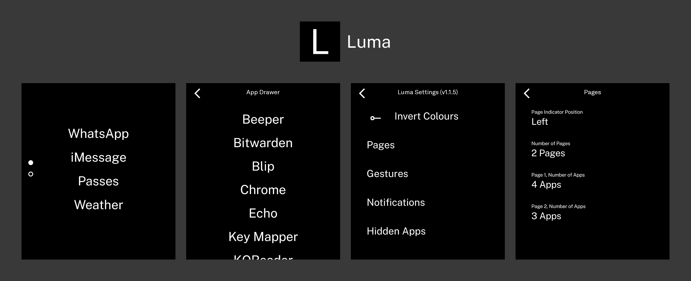

A minimal launcher for the Light Phone III.

## Installation
The lastest .apk file is available in [releases](https://github.com/vandamd/luma/releases/latest).

I recommend using [Obtainium](https://github.com/ImranR98/Obtainium) and adding the repository's URL to receive updates.

## Features
- Text-based home screen
- Up to 5 pages with 1-6 apps each
- Configurable swipe gestures + double-tap
- Hide apps from drawer
- Rename apps

## Acknowledgements
Huge thank you to the following projects:
- Forked from: [OlauncherCF](https://github.com/OlauncherCF/OlauncherCF)
- Inspired by: [InkOS](https://github.com/gezimos/inkOS)

## Support
Luma is developed and maintained in my free time.

If you find it useful, please [consider sponsoring](https://github.com/sponsors/vandamd)! :)
